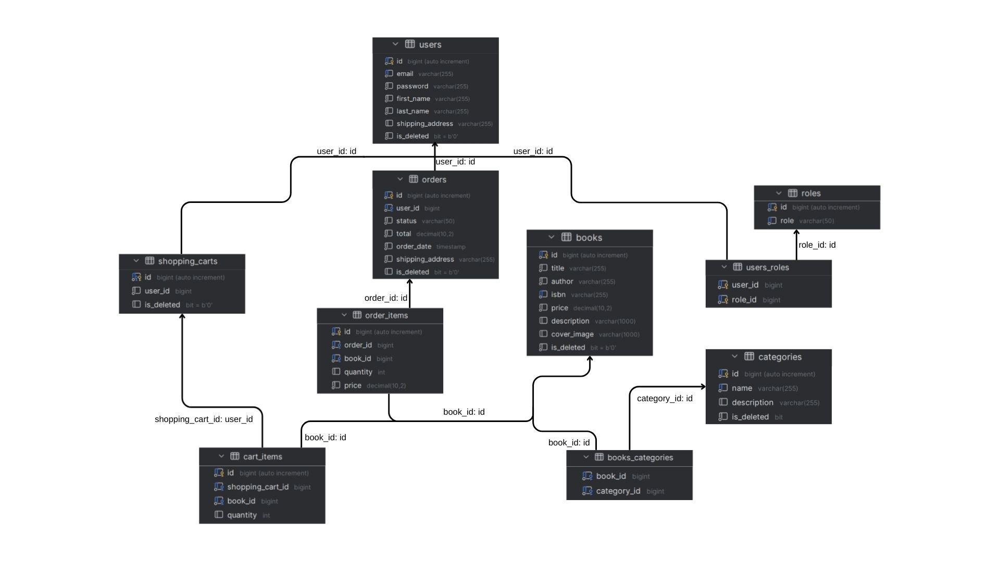

# Book Store Application

**Book Store Application** is a RESTful backend application built with **Java** and **Spring Boot** that provides a complete solution for managing an online bookstore.

The system supports **JWT-based authentication**, **role-based authorization (USER / ADMIN)**, and core e-commerce features including **book and category management**, **shopping cart**, and **order processing**.

The project follows a **layered architecture** and modern backend best practices, making it scalable, secure, and suitable for real-world use cases as well as educational purposes.

---

## Domain Model Diagram

The diagram below represents the core domain entities and their relationships.



---

## Features

- User registration and authentication (JWT)
- Role-based access control (`ROLE_USER`, `ROLE_ADMIN`)
- Books browsing with pagination and sorting
- Categories management (ADMIN-only creation)
- Shopping cart management
- Order creation from shopping cart
- Order history retrieval
- Swagger / OpenAPI documentation
- Database versioning with Liquibase
- Integration testing with Testcontainers (MySQL)

---

## Technologies Used

- **Java 17**
- **Spring Boot 3.4.1**
- **Spring Security + JWT (jjwt 0.12.6)**
- **Spring Data JPA**
- **Liquibase**
- **MySQL 8.0**
- **H2 Database** (optional runtime database)
- **Swagger / OpenAPI (springdoc 2.5.0)**
- **Docker**
- **Testcontainers (MySQL)**
- **JUnit 5**
- **Mockito**
- **MapStruct 1.5.5.Final**
- **Lombok 1.18.30**
- **Checkstyle**

---

## Project Structure

The application follows a classic Spring Boot layered architecture:

```text
src/main/java/org/example
├── config        # Security & JWT configuration
├── controller    # REST controllers
├── dto           # Request / Response DTOs
├── exception     # Custom exceptions & global handler
├── mapper        # MapStruct mappers
├── model         # JPA entities
├── repository    # Spring Data repositories
├── service       # Business logic
└── validation    # Custom validators

src/main/resources
├── application.properties
└── db
    └── changelog   # Liquibase changelogs

src/test
└── unit and integration tests (Testcontainers)
```

## **How to Clone and Run the Project**

Follow these steps to clone the project from GitHub and run it on your local machine:

1️⃣ Clone the Repository Open your terminal or command prompt, and run the following commands:
```text
git clone https://github.com/katrienkraska/Book-Store-Application.git
cd Book-Store-Application
```
2️⃣ Make sure you have the following installed:

- **Java JDK (version 17 or higher recommended)**
- **Maven (for building and running the project)**
- **MySQL**

You can check this using cmd commands:
```text
java --version
mvn --version
mysql --version
```

3️⃣ Configure the Database Check the src/main/resources/application.properties file for database configuration and adjust the database credentials in application.properties.

Configuration file is located at:
```text
src/main/resources/application.properties
```

```text
spring.datasource.url=jdbc:mysql://localhost:3306/bookstore
spring.datasource.username=your_mysql_user
spring.datasource.password=your_mysql_password
```

4️⃣ Build and Run the Application Run the following commands in the project directory:
```text
mvn clean package
mvn spring-boot:run
```

---

## API Documentation (Swagger)

After starting the application, Swagger UI is available at:  
[Swagger UI](http://localhost:8088/api/swagger-ui.html)

---

## Contact

For questions or feedback, feel free to reach out:

- **GitHub:** katrienkraska
- **Email:** kate2002.kk42@gmail.com
